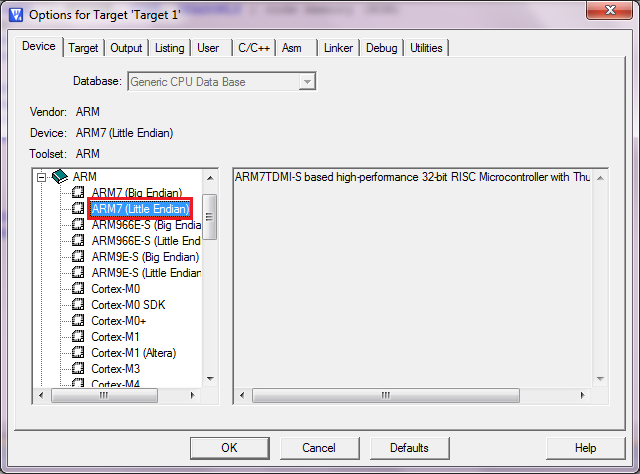
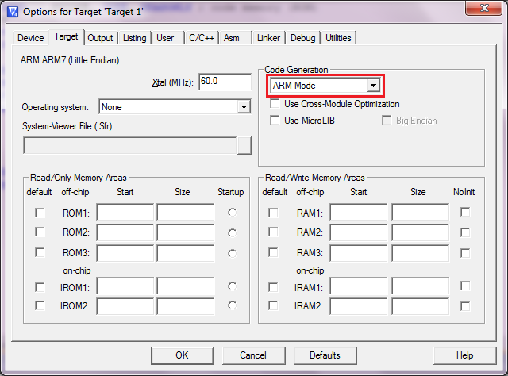
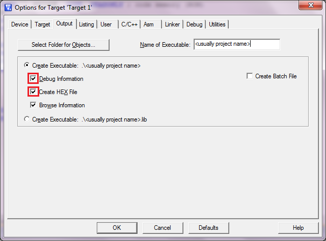
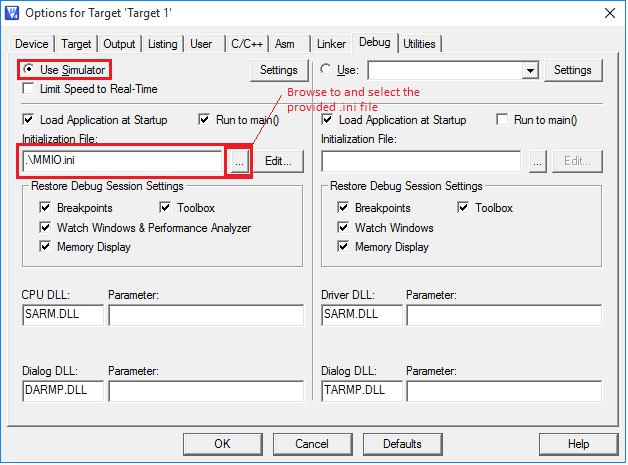
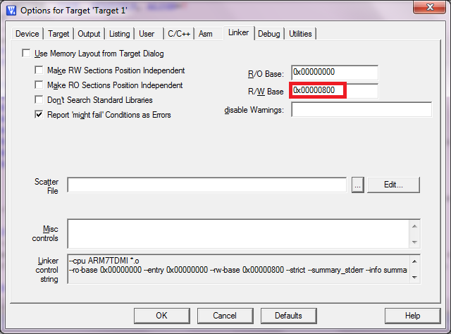
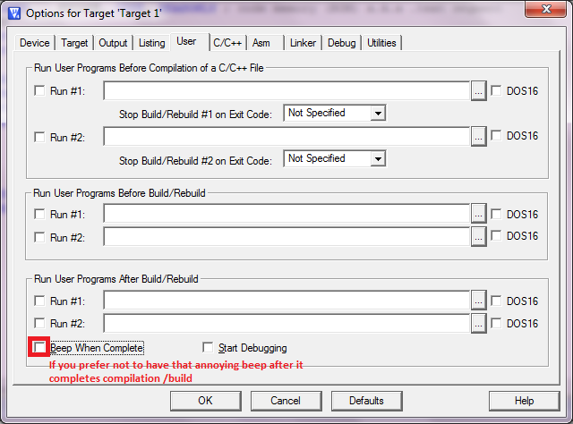
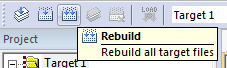
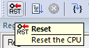
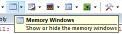

# ARM Programming Guide

Keil MDK is an IDE for ARM assembly/C programming and simulation. The lite version (with 32K code/debug limit and nag-screen) is available for free. You can download it on ARM website.

Note : The latest version is Keil MDK 5. However, you will need to install the legacy support for ARM7 which we are going to use in this module. It is easier to go with Keil MDK 4.

We will be using Keil MDK 4 as it comes with a built in simulator\* for many ARM based cores. This allows you to test your programs before you run it on the processor YOU made. We will be using ARM7 (a _microarchitecture_ executing ARMv3 _instruction set_, not to be confused with ARMv7A/M/R instruction set architecture) in this module, which is somewhat similar to the ARM Cortex M3/M4 you used in LPC1769/STM32L4 (executing ARMv7M) at an assembly level but very different at the machine language level. There are some very significant differences though, which we will see as we go along.

\*Note that the STM32 / LPCXpresso IDE you used in EE2028/CG2028/EE2024 do not have a simulator - to test a program, you needed a microprocessor board.

### Creating a Project and Basic Settings

*   To create a new project, Project > New uVision project. Select a location (preferably an empty folder) and give a name (which will be the same as the name of the Hex file generated by the IDE, so remember the name you gave and the location).
*   You will get a device selection screen. Expand ARM and choose ARM7 (Little Endian).
*   On the project pane on the left, expand 'Target 1' > right-click on Source Group 1. Select 'Add files to Group Source Group 1'.
*   In the file selection window that comes up, in the drop-down list, change 'Files of type' to 'Asm Source file (\*.s\*, \*.src, \*.a\*)'. Browse to the folder containing the assembly language source (.s) file and click 'Add'. Click 'Close' to dismiss the window (it won't disappear even after you select a file).
*   Use this sample assembly language program - [ARM\_sample.s](https://github.com/NUS-CG3207/lab-skeletons/blob/main/lab1/arm_assembly_sample.s). **Please read the instructions in the comments carefully**. The example code will produce this error when you execute the instruction in line 39 (line 30 in the older version) - _error 65: access violation at 0x00000804 : no 'write' permission_. However, this does not cause any problem in real hardware - say, if you try this code on the processor you will be designing in Lab 2. Why?
*   Screenshots illustrating settings are given below. To bring up the window : Project -> Options for Target 'Target 1'. Note that the correct window might come up only on the second try - thanks to the wonderful (sarcasm intended) Keil UI.
*   Use this file [MMIO.ini](https://github.com/NUS-CG3207/lab-skeletons/blob/main/lab1/MMIO.ini) in Project -> Options for Target -> Debug -> Initialisation file (see the screenshot below).

\*See bullet 7 above

**Figure 1(a)-1(f)** : Project > Options for Target '<target\_name>'

*   Please note that syntax highlighting might not work properly for some keywords.

### Programming Instructions

*   Note that the assembler directives in Keil MDK are different from LPCXpresso IDE/GCC toolchain. 
    *   For example, instead of **.word**, Keil uses **DCD** directive. 
    *   The assembler directives can be found [here](http://www.keil.com/support/man/docs/armasm/armasm_dom1361290000455.htm). 
    *   You might be particularly interested in DCD (.word), DSB (store bytes, for strings), SPACE (.lcomm), EQU (.equ). 
    *   Labels do not have a '**:**' following them.
*   PC relative adressing mode (LDR Rd, LABEL) is identical to offset mode, where the base register is implicitly R15/PC (LDR Rd, \[R15, #offset\]). The offset is calculated automatically by the assembler, as the assembler knows the address corresponding to LABEL. Please note that in ARMv3, reading R15/PC returns the current PC+8. 
*   Instructions with R15/PC as an implicit or explicit _source operand_ (for example, PC relative load/source, Data processing instructions with PC as a source operand, Branch) can only use PC+8 value. However, if the R15/PC is specified as a _destination_ (implicity or explicity), the result is written as such to R15/PC.  
*   DO NOT use pseudo-instructions. 
    *   Instead of the pseudo-instruction LDR  R2, =variable1; use LDR R2, variable1\_addr and variable1\_addr DCD variable1. 
    *   This will allow us to have control over where exactly variable1\_addr is stored in the memory, which will make things easier when we insert our program into the Instruction (code) and Data (constant) ROMs created in the FPGA (in Lab 2).
    *   Keil/ARM assembler supports pseudo-instructions, but we just avoid it for the reason mentioned above.
*   You can refer to [ARM Architecture Reference Manual.pdf](https://canvas.nus.edu.sg/courses/62251/files/folder/Lab%20Resources?preview=4733362) to see ARMv3 instruction set architecture.

### Debugging Instructions

*   To start a debug session, go to Debug > Start/Stop debugging session. Debugging is done similar to how it is done in almost all IDEs. You can the see instruction in Hex, inspect register and memory values etc.  
      
    
*   Make sure you do a 'Rebuild All' before you start a debug session () every time you make some changes in code. The IDE will not even prompt you to rebuild your code. It will continue using the binary from your last build, but the code displayed is the latest. This behavior it baffling, to say the least. To avoid it, always Rebuild All before starting a debug session.  
      
    
*   Also note that when you do a CPU reset in the simulator (), the RAM (memory storing variables) in the simulator might not get reset.  
      
    
*   Use memory windows to see the memory contents. . You can click and edit the memory (only regions with read-write permission) if you want to manually change memory values during debugging.

### Converting .hex to ROM Initialization Code

Open the [Hex2ROM](https://github.com/NUS-CG3207/lab-skeletons/blob/main/lab1/hex2rom.exe) program (requires [VS 2012 Redistributable](https://www.microsoft.com/en-sg/download/confirmation.aspx?id=30679&6B49FDFB-8E5B-4B07-BC31-15695C5A2143=1)) and navigate to the .hex file for your project, generated by Keil MDK. The program converts the .hex file into a format which can be pasted into Wrapper.vhd/v (for Lab 2) or the ROMs for Lab 1. The format to be pasted is written into the clipboard as well as to a .vhd/v file having the same name as the .hex file.  
