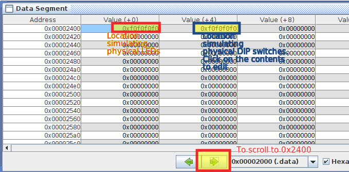
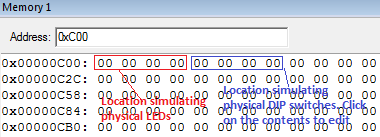
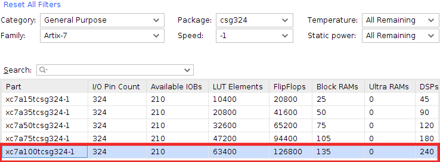
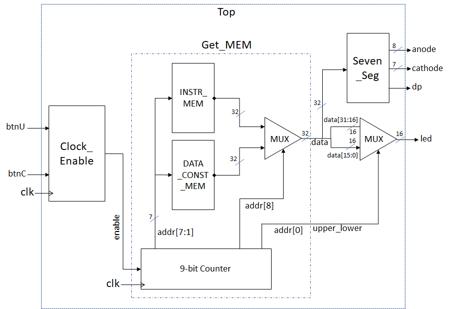

# Lab 1: Familiarisation with Assembly Language and HDL/FPGA

## Information

This lab aims to teach you the tools you will need for this module - namely:

* Assembly language programming and simulation for the RISC-V architecture, and
* HDL simulation and FPGA implementation

This lab may seem quite confusing and tedious at first - this is normal, and nothing to be worried about. It's not directly related to what you're learning in the lectures, and some/all of the tools may be new to you. You might not fully understand the connection between all of the things that you do in this lab, and that's fine. It will all likely make sense once you start doing the subsequent labs, and if it doesn't (or if you just want to understand what you're doing), feel free to ask during the lab sessions, or in the [the discussions](https://github.com/nus-cg3207/lab-skeletons/discussions)) :) 

**NOTE**: Lab 1 is an **individual exercise**. While you will be in teams for later lab work, you will work on your own for this first one. 

## Tasks

### Software (Assembly simulation only)

The goal of this section is to get you familiar with the [RISC-V assembler/simulator](../rv_programming.md) and [ARM assembler/simulator](../arm_programming.md) by simulating a sample program. 

Here, we will do a software simulation of an RISC-V based system with memory-mapped input-output. Assume that the system we are simulating has LEDs mapped to the address `0x00002400` (`0x00000C00` for ARM), such that the data written (using `sw` for RISC-V/`STR` for ARM) to this address location will appear on the LEDs. Also, assume that the system has DIP switches mapped to the address `0x00002404` (`0x00000C04` for ARM) such that the data read from this location (using `lw` for RISC-V/`LDR` for ARM) will reflect the positions of the switches. The program which does that is provided for you, with the details mentioned below. 

Simulate [riscv_assembly_sample.asm](https://github.com/NUS-CG3207/lab-skeletons/blob/main/lab1/riscv_assembly_sample.asm) or [arm_assembly_sample.s](https://github.com/NUS-CG3207/lab-skeletons/blob/main/lab1/arm_assembly_sample.asm). You should understand every line of code, and every directive, in this file - you might be quizzed on these later, *hint hint nudge nudge*. Read [RISC-V Memory Map](../rv_memmap.md) or [ARM Memory Map](../arm_memmap.md) to understand the program better. 

Modify the data in the location pointed to by DIPs and see if the location pointed to by LEDs reflects it. Please see the screenshot below which illustrates how to inspect/modify the memory at location `0x2400`/`0xC00` and `0x2404`/`0xC04`. The value you enter at the location `0x2404`/`0xC04` before executing instruction #4 (line 28 (23 for ARM) in the file) should go into the register `s4`/`R4` after instruction #4, and should be reflected at the location `0x2400`/`0xC00` after instruction #5 (line 29 (24 for ARM) in the code). Are they exactly the same? 



Screenshot of addresses in RARS



Screenshot of addresses in the Keil MDK

Change the `DELAY_VAL` and see if the delay introduced by the delay loop changes accordingly. 

Understand the assembly language instructions and the corresponding hexadecimal (binary) representations. *During Lab 1 evaluation, you should be in a position to convert a given 32-bit binary/hex instruction to the corresponding assembly language instruction and vice versa.*

### Hardware (HDL simulation + hardware)

Task: Display the Instruction (INSTR\_MEM) and Data (DATA\_CONST\_MEM) ROM contents on the physical 7-segment display on the FPGA board. We are doing only a memory dump here; not executing an actual assembly language program.

Templates for Verilog and VHDL for all the boards can be found in [the skeleton file repository](https://github.com/nus-cg3207/lab-skeletons). Note the following:

*   Whether line 29 of the assembly code (for ARM) is commented or not is fundamentally not important as we are doing only a memory dump, not executing an actual assembly language program.
*   Choose the appropriate combination of files depending on the language you are using. Add only those files you need - one each of Top\_Nexys.v/vhd, Seven\_Seg\_Nexys.v, Clock\_Enable.v/vhd, Get\_MEM.v/vhd, and one .xdc file. You are **NOT** obliged to use the templates - it is perfectly fine to have your own architecture.
*   HDL files without any board suffixes are common for all boards.
*   HDL files are common for Nexys 4 as well as Nexys 4 DDR boards. However, the .xdc files are different for the two boards.
*   Seven\_Seg files are available only for Verilog, not for VHDL. The Verilog file can be used if you are using VHDL. You need not modify this file anyway. Files/modules written in the two languages can be mixed freely!
    
| Board  | Part number | Settings |
|--------|-------------|----------|
| Nexys 4 / Nexys 4 DDR | XC7A100T-1CSG324C. Note : Nexys 4 / Nexys 4 DDR both use the same FPGA chip, but pin mappings and hence the .xdc file are different. If you use the wrong .xdc file, you get no warnings at all, (as Vivado cares only about the chip you are using, not the board) but the hardware will be non-functional! | |
    
*   In Lab 1, the assembly language code you created in the software part above (1) is not executed on hardware - we do not have a processor to execute the code yet!. Instead, you will just be dumping the binaries created from your assembly language code onto the 7-segment displays. In other words, you are NOT going to achieve the equivalent functionality as the software above for the hardware in this lab - that is for Lab 2. You will not be using the physical DIP switches for this part.
*   INSTR\_MEM and DATA\_CONST\_MEM ROMs have a capacity of 128 words each and store the instructions and constants in our program respectively. Note that both the memories are word addressable (not byte addressable). There are 128 locations, each location having 32 bits of content, addressed using 7 bits.
*   \[Not needed now\] In Lab 2, we have to make sure that the assembly language programs we run on _our_ processor generate only word addresses (addresses are in multiples of 4). In _our_ processor, we will ignore the last two bits and connect the rest to address lines of the ROM.
*   Please see the end of this section to see how to declare and use INSTR\_MEM. DATA\_CONST\_MEM is also dealt with in the same way. ROM is a combinational circuit and doesn't need a clock. Input to each ROM is a 7-bit address, and output is the 32-bit content in the addressed location.
*   Run the [convert_to_verilog](https://github.com/NUS-CG3207/lab-skeletons/blob/main/convert_to_verilog.py) script, and select the .hex file generated when you build the assembly language program. This will cause the initialization of Instruction and Data ROMs to be copied to the clipboard. This can be pasted into the .v/.vhd file using Ctrl+V.
*   Display the contents of the Instruction and Data ROMs on the 7 segment display. The rate of display should be approximately (**doesn't need to be exact**) 1 instruction/data per second (in the order of 1 instruction per second is ok). 
* You can also optionally choose to display it on the LEDs (**displaying it on the 7-segment display is compulsory**). As each location contains 32 bits through we have only 16 LEDs, display them in consecutive clock cycles\*, with the most significant half-word first.  
*   When the instruction ROM display has been completed, display the contents of the data ROM. Do this in a cyclical manner (infinite loop). Note that each ROM has a capacity of 128 words, but you will only have a small number of valid words. Hence, depending on whether you initialize the unused memory to zero or not, the values that you get after all the instructions are finished could be zero or random. This is fine and you need not skip those zeros / random values automatically. However, note that initializing the rest of the memory to zeros could make your Verilog simulation much slower.

``` 
    for(i = n; i < 128; i = i + 1) begin  
        INSTR\_MEM\[i\] = 32'h0;  
    end
```
    
*   When the pushbutton BTNU is pressed, the display rate should increase to approximately 4 instructions per second (4 times the original rate, whatever the original rate was). The idea is that you will be able to run the zeros/random part faster by pressing this button.  
*   When the pushbutton BTNC is pressed, the display should pause. The student should be able to pause the display and interpret a 32-bit instruction (you will need to pause it two times to see a complete instruction, as you can only display half of one instruction at a time).
*   Your hardware will have BTNU, BTNC, and clk as inputs (each is 1-bit), and 7-segment displays (32-bit) as output. These have to be mapped to the physical BTNs and 7-segment displays on the FPGA board using an appropriate .xdc file (see the [Getting Started manual](https://github.com/NUS-CG3207/lab-manuals/blob/4b14f6d6df9ea91f8b1c5293c303f1fcfeeb5846/getting_started.pdf) if you are unsure how to use design constraints). You should also uncomment the 3 lines related to clk at the beginning of the .xdc file - the create\_clock constraint is to tell the synthesis tool that our hardware works based on a 100MHz clock - info the synthesis tool needs to optimize the circuit appropriately.
*   \[Design hint\]: You can use a 9-bit counter. Bit 0 can be used to select the upper/lower half-words. Bits 7:1 can be used as addresses to both the ROMs. Bit 8 can be used to select the output of INSTR\_MEM/DATA\_CONST\_MEM. The counter is designed such that it counts only once every ~2^26 clocks (approx) normally but will count once every ~2^24 clocks when BTNU is pressed and will pause when BTNC is pressed. This is just a suggestion - there could be other ways too to achieve the same functionality.
*   **Please follow the guidelines given in Chapter 2** while creating your hardware. Ideally, you should use only a single clock in your entire design - the clock of every sequential device should be connected directly to this clock. i.e., you should not use a clock divider.
*   The HDL you write should be simulated using an appropriate **testbench** before you venture into hardware implementation. It is sufficient to demo and submit the testbench for the top-level module.
*   You may refer to the [Getting Started manual](https://github.com/NUS-CG3207/lab-manuals/blob/4b14f6d6df9ea91f8b1c5293c303f1fcfeeb5846/getting_started.pdf) for help with creating and simulating HDL code, as well as for .xdc creation and FPGA implementation. 
*   Debouncing is neither necessary nor very useful for the Lab 1 problem. Debouncing is necessary in situations where, say, you need to count the number of times a button is pressed, or when the button works in a 'toggle' manner (press once to activate something, press again to deactivate) - essentially only where the exact number of times the button is pressed or released matters (contact bounce can cause one press to be counted as many). Here, your system works with one speed when it is pressed, and another speed when it is released - contact bounce is not something that affects the functionality. However, a [metastable filter](https://en.wikipedia.org/wiki/Metastability_(electronics)) could be useful, though probabilistically, it is fine without.

#### Block Diagram for the system



Note: The same clk (100 MHz) is driving the 9-bit counter in the design above.

Using _enable_ as a clock will amount to using a clock divider.

_Enable_ is a signal that has an effect synchronously, i.e., the value of _enable_ is checked only at the edges of _clk_.

\*It is also fine to use a pushbutton (say, BTND) which allows us to select the half-word instead of displaying half-words over consecutive clock cycles. The selection should work even when pause (BTNC) is pressed. In this case, you use an 8-bit counter, with bits 6:0 used as addresses to both the ROMs, and bit 7 used to select INSTR\_MEM/DATA\_CONST\_MEM.

The clock given by the Nexys 4 / Nexys 4 DDR / Basys 3 board is 100MHz. Use the idea illustrated above to implement a **clock enable** to slow down the speed of the target counter (count in the example below) / sequential element. Please note that the below is a sample code, you will need to modify it properly to adapt to your logic/requirements.

|Verilog|VHDL|
|-------|----|
|always @(posedge clk) <br>begin <br> count\_fast <= count\_fast+1; <br>if(count\_fast == 26'h3FFFFFF) // **change it to a lower value (say 26'h0000004) for simulation\***  <br>count\_slow\_enable <= 1'b1;  <br>else  <br>count\_slow\_enable <= 1'b0; // **1'b1 for simulation\***;  <br>end  <br><br>always @(posedge clk)  <br>begin  <br>if(count\_slow\_enable)  <br>count <= count+1;  <br>end |process(clk)  <br>variable count\_fast :std\_logic\_vector(25 downto 0):=(others=>'0');  <br>begin  <br>if clk'event and clk='1' then  <br>count\_fast := count\_fast+1;  <br>if count\_fast = x"3FFFFFF" then -- **change it to a lower value (say x"0000004") for simulation\***  <br>count\_slow\_enable <= '1';  <br>else  <br>count\_slow\_enable <= '0'; -- **'1' for simulation\***;  <br>end if;  <br>end if;  <br>end process; <br><br>process(clk)  <br>begin  <br>if clk'event and clk='1' then  <br>if count\_slow\_enable = '1' then  <br>count <= count+1;  <br>end if;  <br>end if;  <br>end process; |

_\*Do **either** of the two depending on your situation. _Else, you might have to wait for **2^26 cycles** (for a ~1Hz clock) before you can see the effect of 1 clock edge!__

The way a ROM can be created in HDL is shown below.

|Language|Declaration|Usage|
|--------|-----------|-----|
|Verilog| reg \[31:0\] INSTR\_MEM \[0:127\] ; // instruction memory <br><br>type MEM\_128x32 is array (0 to 127) of std\_logic\_vector (31 down to 0)|INSTR\_MEM\[<7-bit word address>\] <br><br>INSTR\_MEM(conv\_integer(<7-bit word address>)) if the address is a std\_logic\_vector|
|VHDL|This is the declaration for the type MEM\_128x32. INSTR\_MEM and DATA\_CONST\_MEM need not be declared as initialization and declaration are done together|INSTR\_MEM(<7-bit word address>) if the address is an integer|

### Optional Tasks (for those new to FPGAs)

Go through the [Getting Started](https://github.com/NUS-CG3207/lab-manuals/blob/4b14f6d6df9ea91f8b1c5293c303f1fcfeeb5846/getting_started.pdf) manual, where the complete FPGA design flow is illustrated - design source creation and editing, simulation, synthesis, implementation, bitstream generation, and FPGA configuration. Note : For Nexys 4 / Nexys 4 DDR, the FPGA part number is XC7A100T-1CSG324C. For Basys 3 board, the FPGA part number is XC7A35T-1CPG236C. Appropriate changes will be required in the project settings.

This manual provides an illustration of the tools you will use in CG3207 through examples of a simple combinational (full adder) and a simple sequential circuit (16-bit shift register). It will familiarize you with industry leader Xilinx's Vivado Design Suite - a comprehensive integrated development environment (IDE) for FPGA design flow, Digilent Inc.'s Nexys 4 Development Board featuring an FPGA from Xilinx's state-of-the-art Artix-7 family, and VHDL/Verilog.

Program the FPGA using the simple_count.bit given in this zip file (VHDL) or this zip file (Verilog). See the counter in action. This can be used to test the board and will help you get started. Note : Works only for Nexys 4 board.
	
1. Download the above file and unzip it.
2. Open the `simple_count.xpr` Xilinx Vivado Project.
3. Have a look a the code files `simple_count.vhd` (VHDL) / `simple_count.v` (Verilog), and `Nexys4_Master.xdc` in \simple_count.srcs folder.
4. Either Generate Programming File, or simply use the existing `simple_count.bit` file in `\simple_count.runs\impl_1\`.
5. Program the Nexys 4 board with the simple_count.bit file.
6. Notice that LED0, LED1, LED2, and LED3 together behave like a 4-bit counter on the Nexys 4 board. The MSBs of a 30-bit string `000000000000000000000000000000` are shown on the LEDs. The rest of the string change values too fast for the human eye. Also, note that if the BTNC button on the Nexys 4 board is pressed, the counter is paused - refer to the VHDL/Verilog code (.vhd/.v) and constraints file (.xdc).
7. Augment the sample counter (in step 1) as follows :
	When a button DIR is pressed, the counter should toggle the count direction. Upon pressing the RESET button, the counter value should be reset (synchronously or asynchronously) to `0000` when counting up, and to `1111` when counting down. 
	The counter has 4 different speeds - 1x (the default speed), 2x, 3x, and 4x. A button SPEED is used to change the speed of the counter -  each press of SPEED increases the speed, and if the current speed is 4x, it wraps around to 1x.
	Note : You will need to debounce DIR and SPEED buttons to observe the desired results (why?). However, debouncing is left as an optional task. The priority of buttons (i.e., what should happen when two or more buttons are pressed together) is left to your discretion.

## Submission Info
* Lab 3 will be evaluated in **Week 5**. The presentation schedule can be found on Canvas. 
* Please upload the Lab 3 files to Canvas **within 1 hour of your demo in week 5**, including the following files:  
	* **.s/.asm** file (assembly language program, if you have modified it)
	* **.v/.vhd** files (RTL sources aka your synthesizable HDL, testbenches)
	* **.xdc** file
	* **.bit** file
	* **Screenshot of simulation waveform (.jpg file)**. Note that all signal names should be captured.

in the format **Lab1\_<MON/FRI>\_<Matric Number>.zip,** e.g. **Lab1\_MON\_A123456W.zip**. DO NOT zip up the complete project folders or individual files one by one. **The files should be the exact same files that you used for the demo**. Additional marks will not be awarded for any fixes/improvements that you made to the code after the demo.

## Tips

* Read Chapter 2B thoroughly and make sure your code is synthesizable.
* If you want the clock to be effective only under certain situations, use a clock enable.
* Synchronize all inputs at the earliest possible opportunity.
* Synthesize each entity / module by setting it as the top-level module and check for errors / warnings.
* See the elaborated design to see if the schematic matches your intended design.
* Inspect the synthesis report to see if the primitives (basic digital building blocks) inferred make sense.
* Xilinx Vivado's text editor is not very good. You might want to use a better editor like Notepad++ to keep the code properly intended.
* It might take a bit of time, effort, and frustration before you are able to write good synthesizable code. Sometimes, you can’t get a better teacher than experience, especially so when it comes to writing good Verilog code. Just hang in there and you will be ok soon. The best bet is to go through the notes and have the hardware in mind while writing the code.
* It is generally a good idea to use project folder paths that do not have spaces, special characters, etc.
