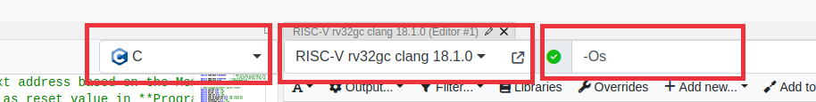
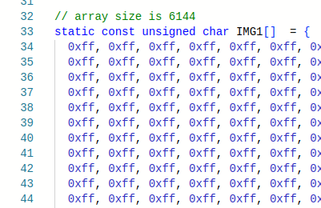
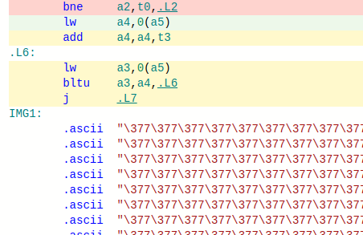
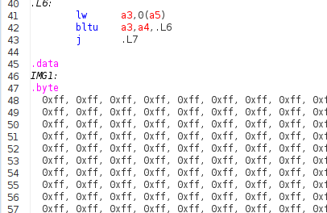

# Lab 4: Using Compiled Code and New Peripherals

## Using Compiled Code

It is strongly recommended to use the new template files at <https://github.com/NUS-CG3207/lab-skeletons/tree/main/lab2/V3> if you're using compiled code.  

* If you do not upgrade, you will have to manually segregate static constants and variables to ROM and RAM, and static variables can only be zero-initialized.  
* If you're upgrading from version 1 of template files, you will need to change Wrapper, TOP, and RV. Since you modified RV to implement the processor, you will need to merge changes, which is quite easy. 
* If you're upgrading from version 2, only Wrapper and TOP will need to be changed.  
* Use ProgramCounterv2 if your memory configuration is such that .text starts at a location other than 0. You will need to do this if you want to load a full-resolution image (see the OLED section below). 
* Use RegFilev2 if you wish to use synchronous read, which may be used to infer block RAMs.
* You will need to add ADXL362Ctrl.vhd, SPI_If.vhd, pmodoledrgb_bitmap.vhd to your project as it is needed in TOP v3.

You can use the .C file in the folder above as a sample. The corresponding .asm is also provided for reference.  

Please note some other points below.

* To the extent possible, it is a good idea to test your algorithms (e.g., masking and shifts to deal with bytes within a word.) in a standard C compiler, making appropriate changes (e.g., printf and scanf/hardcoding to simulate actual system input and output) to run in a desktop environment.
* Follow the Godbolt settings as shown.
  * The default Godbolt language maybe C++, change it to C. C++ compiler does stuff like name mangling which we can do without.
  * Clang produces more comprehensible code than GCC, though sometimes at the expense of increased code size.
  * In fact, GCC with -Os -fwhole-program can produce very compact code, but can be pretty hard to make sense of. In any case, do not use the trunk version of GCC.
* Do not use library functions such as `printf()`. If need be, implement your own, simple versions of these functions.
* Make sure that only those instructions supported by your processor are generated. Check in the RARS execute window for actual instructions.
* Typically, the only essential change needed for the assembly code generated by Godbolt/Clang is to have a .data inserted just before the data declarations.
* Check the actual number of instructions (not lines of code as some instructions are pseudoinstructions). Make sure the size is set in Wrapper IROM_DEPTH_BITS as appropriate. e.g., should be 10 if the number of instructions is >128 and <=255.
* DMEM_DEPTH_BITS should also be changed as appropriate. It should be 10 for using the original peripheral addresses in the previous versions of the wrapper (as the DROM+DRAM is 256 words). However, if you need more memory (DRAM+DROM) such as what you will need when you load images, change this. STACK_INIT and MMIO_BASE in your C source code should also be modified to correspond to this.
  * Stack pointer is set to point to the top of RAM initially (STACK_INIT). The stack is full-descending, so the first value is pushed to STACK_INIT-4.
  * In the example C code (in the repo above), this is done via inline assembly. Alternatives are
    * Insert an assembly statement `la sp, STACK_INIT` as the first line in your assembly code .text section.
    * Hard-code `RegBank[5'b00010]` initialization value to `STACK_INIT` via an `initial` block in RegFile.v. Of course, `STACK_INIT` should have a proper value via a `.equ` or be passed as a parameter to the RegFile module.
* Make sure the correct memory config is selected in RARS.
* The first few instructions that save Callee saved registers to the stack can be deleted safely - do a sanity check to see if this is really the case nevertheless. There is no caller for main(). Ensure that the inline assembly to set the stack pointer (`sp`) to the correct value should be the first useful instruction.
* Make sure the main function code is at the beginning. Some compilers such as gcc may put this in the end, in which case you need to rearrange the functions in assembly. Our absolute bare-metal system does not have a linker/loader/startup code to start at the main if it is not in the beginning.
* Simulate the code in RARS.
  * When using memory-mapped input peripherals, the corresponding address location should be modified just before the corresponding `lw` is executed to simulate the data coming in from peripherals.
  * If you are using the counter peripheral for delay, you might want to use a smaller delay for simulation and change the code to a bigger value later. This can be changed in C code or directly in assembly (likely lui)
  * Though you can't see OLED output, it is fairly easy to check the row, column, pixel colour, and pixel write signals and get a sense.
* Export the instruction and data memory as hexadecimal text, overwriting the AA_IROM.mem and AA_DRAM.mem that are added to the Vivado project.
* Simulate in HDL behavioral sim, after changing the test_Wrapper to give stimuli according to the inputs expected by your C/assembly program.
* Finally, synthesize and generate bitstream. Fingers crossed :)

## Using New Peripherals

The register info for the new peripherals cycle counter, accelerometer, and OLED display peripheral register can be found in the Wrapper (v3) HDL code. 

### Cycle Counter

Cycle counter gives the number of processor cycles that have elapsed since the last reset.  
Cycle counter rolls over at 42 seconds at 100 MHz (CLK_DIV_BITS = 0), but is much longer at lower frequencies.  
Change counter width and bits used in Wrapper for a longer duration, but lower cycles precision.  

### Accelerometer

The accelerometer gives the temperature and X, Y, Z accelerations.  
ACCEL_DATA is a 32-bit value packing 4 independent 8-bit values <temperature, X, Y, Z> MSB downto LSB.  
Each value is in 8-bit signed format with a range of +/- 2g. So a reading of 1g is 0x40 and -1g is 0xC0.  
The sensor in fact gives a 12-bit reading, but uses only 8 bits for simplicity.  
The calibration is not perfect on all boards, so do not be surprised if there is a fixed offset to all your readings.  

If you want only a specific axis or temperature, use a combination of logical operators and shift e.g., extract Y using (*ACC_DATA_ADDR & 0x0000FF00) >> 8. If your processor can do `lbu`, the required byte can be read directly.  

ACCEL_DREADY indicates data readiness, which is useful only when attempting to read at a high rate.

### OLED

OLED uses PMOD **B**.

The OLED controller has a built-in buffer, which means that your program does not have to keep feeding pixels continuously. Only changes need to be written.  

Caution: Do not leave OLED on for too long unnecessarily, especially with the same frame. It can cause burn-in.  

OLED_CTRL register functionality is described below.  

OLED_CTRL[3:0] : Change that triggers write. We can vary one of them (e.g., column) while keeping the other two the same. This can be efficient in applications like  [vector](https://en.m.wikipedia.org/wiki/Vector_graphics) graphics, where replicating a pixel along a row or column is common. In the example program where a line with a specified colour is drawn, we vary only x (columns).

* 0x0: vary_pixel_data_mode
* 0x1: vary_COL_mode (x)
* 0x2: vary_ROW_mode (y)

OLED_CTRL[7:4] : Colour format.

* 0x0: 8-bit colour mode: 1 byte per pixel, memory efficient especially if loading bitmapped images. Format: 3R-3G-2B.
* 0x1: 16-bit colour mode: Highest colour depth supported by the OLED in a compact representation. It is the OLED native input format: 5R-6G-5B.  
* 0x2: 24-bit colour mode: Similar to standard displays, but some LSBs are not used. Easier to visualise in simulation as each colour is a 2-hex digits. Wrapper output format: 5R-3(0)-6G-2(0)-5B-3(0).  

#### Loading Images

The easiest way to load a [raster](https://en.wikipedia.org/wiki/Raster_graphics) image is to hard-code the array in C or assembly. This can be done easily using an online tool such as https://notisrac.github.io/FileToCArray/.  
 
It is also possible to receive the image at runtime via UART or initialise it in your HDL via a .mem file. However, these will limit your ability to simulate in RARS.

Before you think of loading a raster image - Make sure your data memory is big enough to hold the image. Adjust the depth/size in both HDL and C!
A not-too-complex vector image may not need a memory size increase or memory configuration change.

For a full-resolution raster image (96x64), the data memory size needed will exceed the 0x2000 size provided by the 'compact, text at 0' configuration that we have been using. You will have to resort to the RARS default configuration in this case.  
This requires changing

* initialization and reset value of the program counter in ProgramCounterv2 file (2 places in total) to 0x00400000.
* IROM_BASE and DMEM_BASE to 0x00400000 and 0x10010000 respectively in Wrapperv3 as well as the C code 
* DMEM_DEPTH_BITS in Wrapperv3. A full-resolution image with even 8-bit colour mode requires 6144 bytes, which means a DMEM_DEPTH_BITS of at least 13! The C code DMEM_SIZE should be 2^DMEM_DEPTH_BITS which is 0x2000 for DMEM_DEPTH_BITS of 13.

When you export byte arrays in the data segment from Godbolt to RARS, there could be an issue - RARS doesn't recognize the octal escape sequence emitted by compilers. A workaround is to copy-paste the actual C array into the data segment of RARS with a .byte declaration, instead of using the .ascii array emitted by the compiler. The rest of the generated assembly is fine. This is illustrated in the figures below.  

  
C Code  

  
Octal array emitted by the compiler  

  
Copy-pasted array fix in RARS with .byte declaration

Food for thought:

* It may be better to use synchronous read and use block RAMs if you have many images. Else, you will quickly run out of LUTs.
* Image pixels being sent column-wise is advantageous if the conversion tool can give a column-major format for the array. This is because multiplication by 64 is easier than by 96.
  * Clang emits `mul` instructions when you multiply by 96, GCC does y\*64+y\*32 instead in some optimization modes.
  * It is not uncommon to allocate memory that is larger than the required size to make the buffer dimensions powers of two - trading off memory for performance!
  * Possible enhancement: Implementing a mode where the row/column indices autoincrement in a row-major/column-major manner can accelerate the loading of raster images. Only one write per pixel will suffice, with the ability to feed data from a C array without maintaining separate row/column indices. You will need to implement some control bits in the control register to enable this (and an additional bit if you wish to allow the user to choose between row-major / column-major formats), along with other changes in the Wrapper. 
* It is not possible to read back what you wrote to the OLED. Something = *OLED_DATA_ADDR does not work. These are memory-mapped peripherals; do not treat like memory. However, it is possible to modify the Wrapper and TOP to accomplish this, but has some issues such as needing 2 clock cycles for a read.
