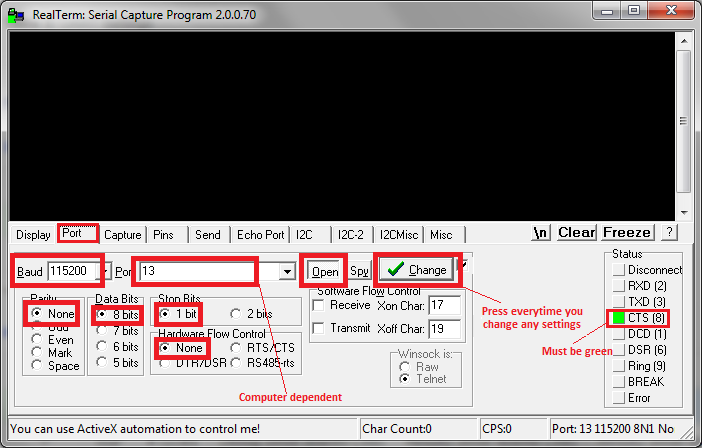
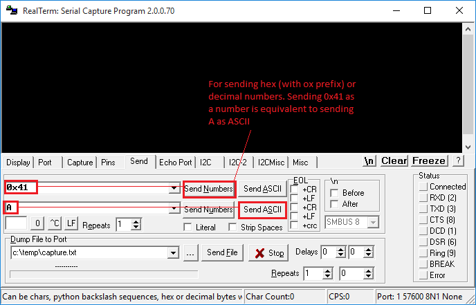

# UART and RealTerm

## UART Details

In the following lines, 'read's and 'write's are from the perspective of the RISC-V processor (assembly language program), and act as 'console in' and 'console out' respectively.

*   Read from the UART only if CONSOLE\_IN\_valid is set. Similarly, write to the UART only if CONSOLE\_OUT\_ready is set  (not very important if the processor runs on a slow clock).
*   Successive writes to the UART (**sw** / **STR** followed by **sw** / **STR**, i.e., consecutive **sw**s / **STR**s in your assembly language program) are not supported. Similarly, successive reads (consecutive **lw**s / **LDR**s) are not supported.
*   Allow sufficient time for the program to read a character before sending the next character from RealTerm. Any character received while one character is waiting to be read would be ignored. This shouldn't be a problem if your processor runs at high speed (CLK\_DIV\_BITS is low).
    
*   A 32-bit number can be sent as hexadecimal in ASCII format (8 characters), which will require some processing in your program before it can be used as a 32-bit operand (note : '0' is 0x30 and 'A' is 0x41 in ASCII). It is a good idea to echo characters so that you can check whether UART has received it correctly. Also, note that backspace doesn't work to 'delete' the sent characters unless you implement such a functionality explicitly in your assembly language program. 
    
*   If you use a console, some parts of your program could be repetitive, best implemented using a subroutine. A subroutine is normally implemented using a **BL**/**jal** instruction which we have not implemented. A workaround can be seen in the HelloWorld program for Lab 2.
    
*   In the simulation with UART, setting radix to ASCII could help.
*   Read the instructions in Wrapper.v/vhd before using it.

## Realterm

[Realterm](https://canvas.nus.edu.sg/courses/62251/files/folder/Lab%20Resources?preview=4733363) is an amazing serial monitor program, which could be very useful. You can use this for sending and receiving data through the UART console. Teraterm (used in EE2028) is fine too, just that RealTerm is TeraTerm on steriods. RealTerm needs [.NET framework](https://canvas.nus.edu.sg/courses/62251/files/folder/Lab%20Resources?preview=4733365) to be installed.

Note : The baud rate used depends on the baud rate set in TOP.vhd. In the template provided, it is 115200.

**Figure 1(a) and 1(b)** : Screenshot illustrating RealTerm settings.

RealTerm allows you to send and display data that is not necessarily ASCII. Sending and receiving raw bytes can be very very useful. In fact, it is THE most effective way to get data in/out of the system.  

(to do: Provide a screenshot here illustrating sending bytes, and perhaps even an example assembly language program).